# Titanic Analytics

This module profiles and cleans the Seaborn Titanic dataset, tells a short story with the data, and compares leakage-safe classifiers with a separate fare regression task. The analysis runs from one script so the raw data is loaded once and every step is easy to reproduce.

## Setup and run

```powershell
cd analytics
python -m venv .venv
.\.venv\Scripts\Activate.ps1
python -m pip install -r requirements.txt
python analysis.py
```

Use `python analysis.py --offline` to read the committed `titanic.csv` directly. A normal run calls Seaborn's loader once and saves the original, uncleaned data to that same CSV before analysis. Generated tables, plots, metrics, and the fitted classifier pipeline are saved under `outputs/`.

## Design decisions

- Keep the raw CSV as the reproducible offline copy; drop only rows with low missingness in required fields and exclude highly sparse or redundant columns.
- Use one cleaned working dataset for the EDA and modeling stages. EDA fills age with the median for the exploratory plots, while modeling keeps missing ages until the stratified split and learns the median inside each training-only preprocessing pipeline.
- Keep transformations inside scikit-learn pipelines so imputers, encoders, and scalers are fitted on training data only. Save the fitted preprocessing and estimator together for raw-row predictions.

## Measured results and interpretations

Dataset source: `offline CSV (titanic.csv)`. The untouched dataset has shape `[891, 15]` and is saved as `titanic.csv` before cleaning. The cleaned modeling/EDA frame has 889 rows.

## Missingness and Cleaning

| Column | Missing | Decision |
|---|---:|---|
| `deck` | 77.22% | drop column (77.22% missing; above 30%, too sparse to impute) |
| `age` | 19.87% | median imputation (19.87% missing; within the 5%–30% range), fit only on the training split for modeling |
| `embarked` | 0.22% | drop affected rows (0.22% missing; below 5%); embarked is a model feature and fare is the regression target |
| `embark_town` | 0.22% | drop with the corresponding embarked row (0.22% missing; below 5%); this is a redundant text label for embarked |

Missingness under 5% is handled by dropping affected rows; 5%-30% uses median imputation for age; columns above 30% missing are dropped rather than imputed. `deck` is excluded because 77% of its values are missing, and `embark_town` is a redundant label for `embarked`. Modeling imputers, encoders, and scalers are fitted only on the training split inside each scikit-learn Pipeline.

## Univariate Analysis

IQR outlier counts: age **32**, fare **114**. Fare mean = 32.0967, median = 14.4542, and mode = 8.0500; this is **right-skewed (mean > median > mode)**.

| Age histogram and box plot |
|---|
| 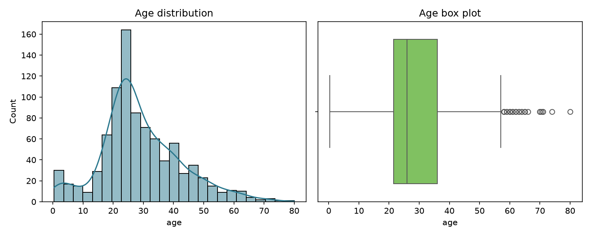 |

| Fare histogram and box plot |
|---|
| 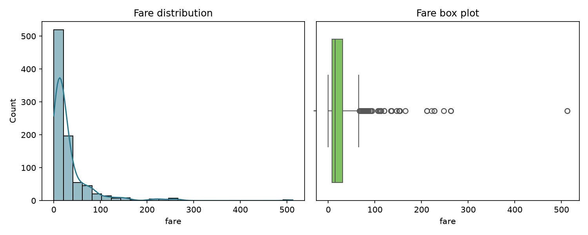 |

## Bivariate and Multivariate Story

Survival rate by sex: `{"female": 0.7403846153846154, "male": 0.18890814558058924}`. By passenger class: `{"1": 0.6261682242990654, "2": 0.47282608695652173, "3": 0.24236252545824846}`. By sex and class: `{"female, class 1": 0.967391304347826, "female, class 2": 0.9210526315789473, "female, class 3": 0.5, "male, class 1": 0.36885245901639346, "male, class 2": 0.1574074074074074, "male, class 3": 0.13544668587896252}`. The requested correlations use exactly `survived, pclass, age, sibsp, parch, fare`; `adult_male` and `alone` are excluded because they are derived flags.

The two strongest absolute off-diagonal correlations are `pclass` with `fare` (r = -0.5482) and `sibsp` with `parch` (r = 0.4145). Class and fare are negatively associated, consistent with higher fares being more common among lower-numbered classes; siblings/spouses and parents/children counts are positively associated, as family groups often traveled together.

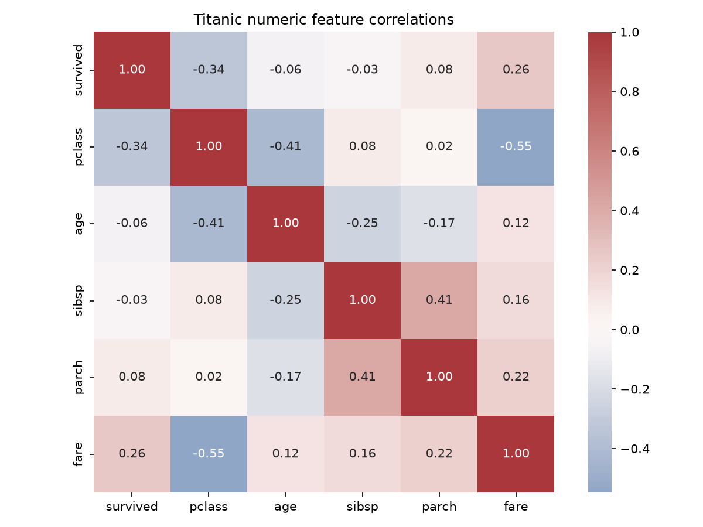

### Survival Rate by Sex

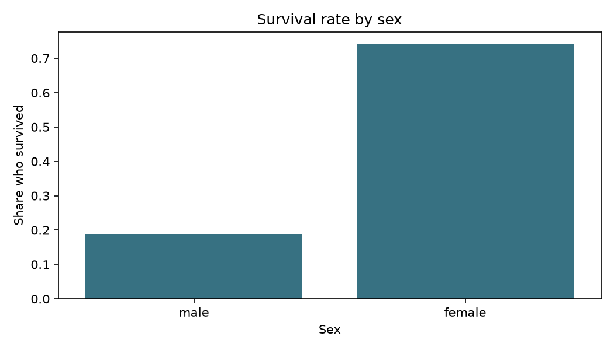

Women survived at 74.0%, compared with 18.9% of men. This large descriptive difference makes sex an important predictor in this sample, but it is not by itself a causal explanation.

### Survival Rate by Passenger Class

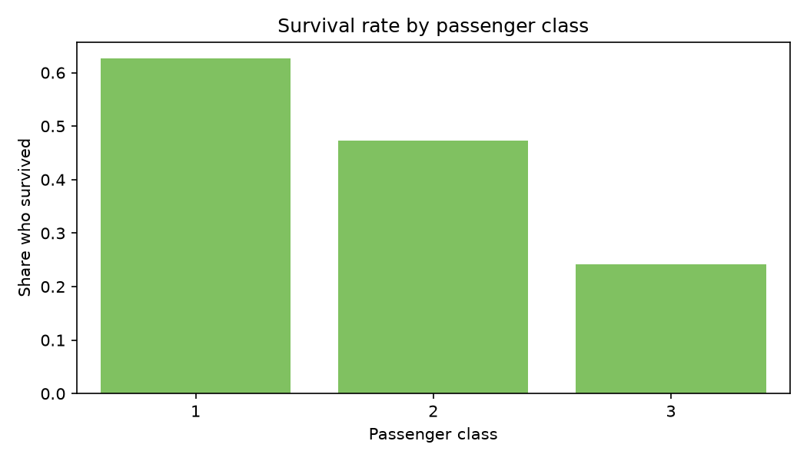

Survival rates were 62.6% in first class, 47.3% in second class, and 24.2% in third class. The stepwise decline shows a clear association between passenger class and survival.

### Survival by Class and Sex

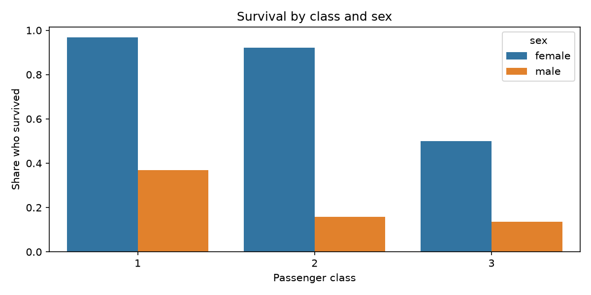

Within first, second, and third class, female survival was 96.7%, 92.1%, and 50.0%; corresponding male rates were 36.9%, 15.7%, and 13.5%. Both variables distinguish outcomes, and the grouped chart makes their interaction visible rather than averaging across groups.

### Age, Sex, and Survival

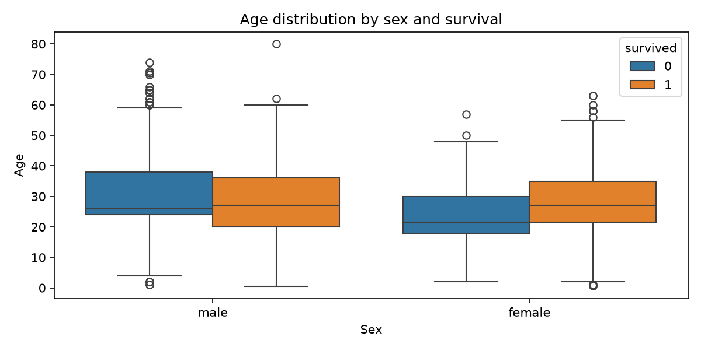

Median ages for women were 27.0 among survivors and 21.5 among non-survivors; for men they were 27.0 and 26.0. The overlap in the box distributions indicates that age adds context but does not cleanly separate survival outcomes by itself.

### Fare by Passenger Class

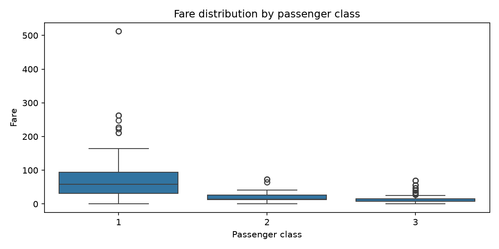

Median fares were 58.69, 14.25, and 8.05 for first, second, and third class respectively. Fare therefore reinforces the class pattern in the survival charts, while also acting as a proxy for ticket/cabin access rather than an isolated cause.

### Exploratory Standardization

These full-cleaned-frame z-scores are only an EDA check and are not used in modeling; model scalers are fitted on training folds only.

| Feature | Before mean | Before std | After mean | After std |
|---|---:|---:|---:|---:|
| age | 29.0654 | 13.2627 | 0.00000000 | 1.00000000 |
| fare | 32.0967 | 49.6695 | 0.00000000 | 1.00000000 |

## Classification and Regression Comparison

The stratified split retained a similar survival share in both partitions (train 38.3%; test 38.1%), important because the classes are not balanced. All three classifiers use the same split and report confusion matrices in `results.json`; the decision-tree plot labels the transformed feature and class names.

| Model | Accuracy | Precision | Recall | F1 | AUC | MAE | RMSE | R-squared | Adjusted R-squared |
|---|---:|---:|---:|---:|---:|---:|---:|---:|---:|
| Logistic Regression | 0.7803 | 0.7143 | 0.7059 | 0.7101 | 0.8365 | - | - | - | - |
| Decision Tree | 0.7848 | 0.8246 | 0.5529 | 0.6620 | 0.8056 | - | - | - | - |
| Random Forest | 0.7668 | 0.6737 | 0.7529 | 0.7111 | 0.8221 | - | - | - | - |
| Linear Regression (fare) | - | - | - | - | - | 19.9647 | 38.4242 | 0.3586 | 0.3284 |

Classification and regression metric columns are kept separate; `-` means that metric does not apply to that model type.

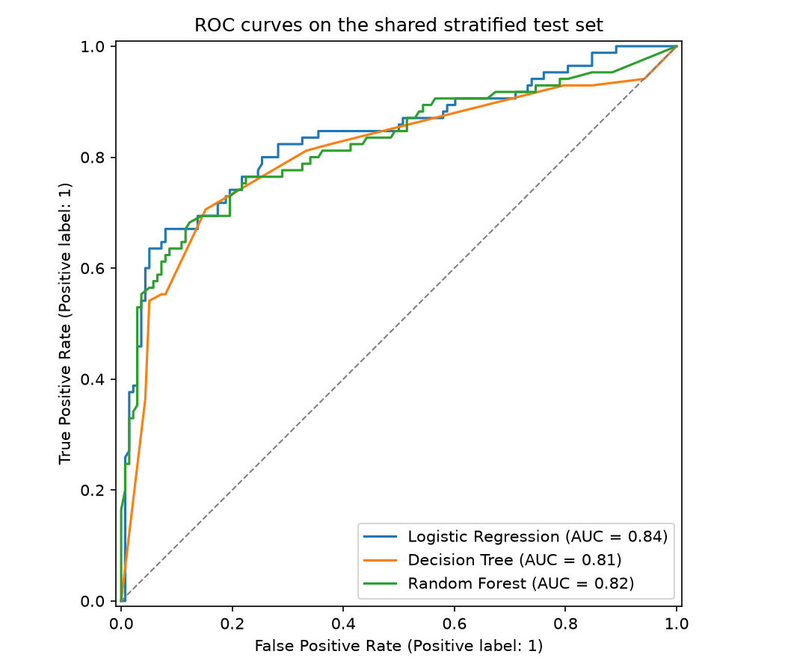

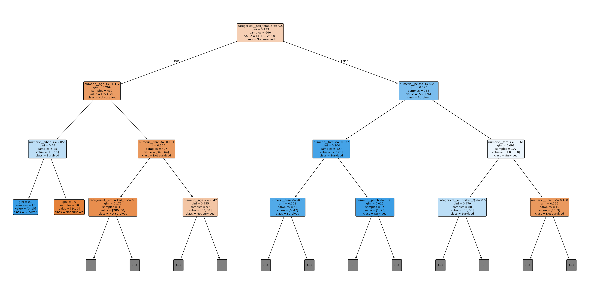

### Imbalance Handling

Training class counts were `{"not_survived": 411, "survived": 255, "train_survival_rate": 0.38288288288288286}`. SMOTE is applied only to transformed training rows; the test fold is never resampled.

| Strategy | Precision | Recall | F1 |
|---|---:|---:|---:|
| Baseline | 0.6737 | 0.7529 | 0.7111 |
| class_weight='balanced' | 0.6633 | 0.7647 | 0.7104 |
| SMOTE (training rows only) | 0.6632 | 0.7412 | 0.7000 |

`Baseline` had the highest F1 (0.7111) in this held-out comparison. This favors the observed precision/recall balance for this split; another operational objective could prefer higher recall even at lower precision.

### Random Forest Grid Search

GridSearchCV best parameters: `{"model__max_depth": 5, "model__max_features": "sqrt", "model__n_estimators": 200}`. Best cross-validation ROC AUC was 0.8584; the best estimator was constructed with `oob_score=True` and achieved OOB score 0.8213.

### Fare Regression

Linear regression predicts fare from the other available features, including survival outcome. Metrics: MAE 19.9647, RMSE 38.4242, R-squared 0.3586, adjusted R-squared 0.3284. The residual standard deviations across predicted-fare quartiles vary by a factor of 8.41. Under the stated 2x spread check, this suggests heteroscedasticity; the residual plot is included below for visual inspection.

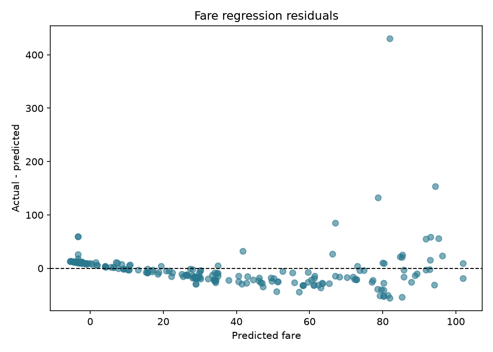

## Deployment Recommendation

I recommend **Random Forest** among these three classifiers because it has the best held-out F1 (0.7111), with accuracy 0.7668, precision 0.6737, and recall 0.7529. Its ROC AUC is 0.8221; Logistic Regression's AUC is 0.8365, so the Random Forest's thresholded F1 advantage does not mean it ranks cases best on every metric. The saved artifact is the complete tuned preprocessing-plus-estimator pipeline and has been reloaded to predict from raw, unprocessed input rows. I would validate calibration and performance on a more recent, independent population before deployment.

Reload test prediction on a raw row: `0`. Saved pipeline: `outputs\titanic_classifier.joblib`.
